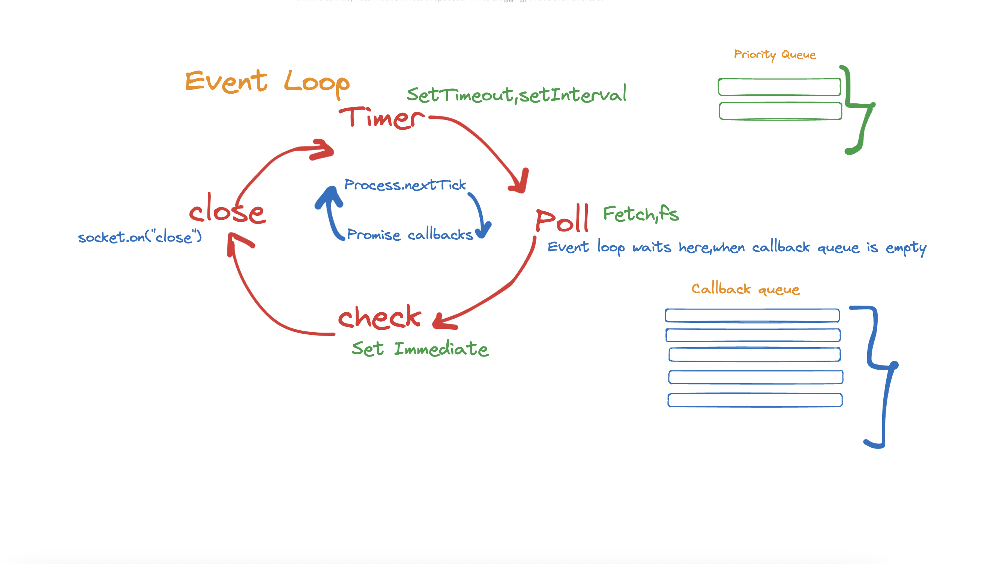

# LibUV and Event Loop in Node.js

- The LibUV event loop is a crucial component of Node.js, designed to efficiently handle asynchronous operations. It integrates seamlessly with the V8 engine's call stack to enable non-blocking execution.

## How It Works

- **Call Stack and Event Loop:** When the call stack is empty, the event loop steps in to manage asynchronous tasks.
- **Offloading Tasks:** These tasks are offloaded to LibUV, which handles their execution in the background.
- **Callback Queue:** Once a task is completed, its callback is queued based on priority.
- **Execution:** The event loop processes callbacks in priority order, ensuring they are executed when the call stack remains empty.

- This architecture allows Node.js to handle concurrent operations efficiently, making it ideal for building scalable, real-time applications.

